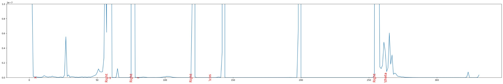

# CROHME CTC - Math Formula Recognition



## Overview

This project aims to convert handwritten mathematical expressions into digital format using advanced deep learning techniques. It employs Long Short-Term Memory (LSTM) networks enhanced with Connectionist Temporal Classification (CTC) Loss and a custom Relative Position Loss, significantly improving the accuracy of symbol detection.

## Getting Started

### Prerequisites

Ensure you have Python 3.8 or higher and pip installed. This project uses PyTorch, PyTorch Lightning, and other dependencies which can be installed using the provided requirements file.

### Installation

1. Clone the repository

   ```sh
   git clone https://github.com/fuisl/crohme-ctc.git
    ```

2. Setup conda environment with .yml file

    ```sh
    conda env create -f environment.yml
    ```

3. Activate the environment

    ```sh
    conda activate crohme-ctc
    ```

### Preprocessing

1. Download the CROHME dataset from the official website: [CROHME](https://www.isical.ac.in/~crohme/) or use the provided dataset in the `dataset` folder.

2. unzip the dataset with the following command:

    ```sh
    unzip dataset/dataset.zip
    ```

## Usage

### Training

To train the model, run the following command:

```sh
python train.py
```

This will train the model using the default configuration. You can modify the configuration by changing the values in the `train.py` file.

### Inference


For inference, open and run the `infer.ipynb` notebook. This notebook guides you through loading a trained model, preparing the data, and performing predictions to detect mathematical symbols in handwritten documents.


### Evaluation (TBA)

To evaluate the model, run the following command:

```sh
python evaluate.py
```

This will evaluate the model using the default configuration. You can modify the configuration by changing the values in the `evaluate.py` file.

## Project Structure

The project is structured as follows:

```graphql
crohme-ctc/
│
├── models/                     # Model definitions and utilities
│   ├── __init__.py
│   ├── lstm_ctc.py             # LSTM models for temporal classification
│   └── utils/                  # Utilities for custom metrics and loss functions
│       ├── edit.py             # TokenEditDistance metric
│       └── loss.py             # RelativePositionLoss and AWPLoss functions
│
├── data.py                     # Data handling for INKML files
├── train.py                    # Training script
├── infer.ipynb                 # Jupyter notebook for inference
└── README.md
```

## Model and Training Details

### LSTM_TemporalClassification

- **Architecture**: Consists of LSTM layers followed by a fully connected layer and LogSoftmax activation.
- **Functionality**: Designed to process sequential data and perform classification at each timestep.

### Connectionist Temporal Classification (CTC) Loss

- **Functionality**: Used to train models for sequence-to-sequence tasks where the alignment between input and output sequences is unknown.

### Relative Position Loss

- **Functionality**: Custom loss function that penalizes the model for incorrect symbol positions relative to the ground truth.

### LSTM_TemporalClassification_PL

- **Integration**: Enhanced with PyTorch Lightning to streamline training loops, validation, and testing.
- **Losses**: Utilizes CTC Loss for sequence modeling and a custom Relative Position Loss to improve the spatial relationships in predictions.

## Contributing

Contributions are welcome! Please create a new branch and submit a pull request with your changes.

1. Fork the Project
2. Create your Feature Branch (`git checkout -b feature/AmazingFeature`)
3. Commit your Changes (`git commit -m 'Add some AmazingFeature'`)
4. Push to the Branch (`git push origin feature/AmazingFeature`)
5. Open a Pull Request

## License

Distributed under the MIT License. See `LICENSE` for more information.

## Acknowledgements

- Dr. Nguyen Tuan Cuong for his guidance and support throughout the project with the theoretical aspect and practical implementation of the model.
